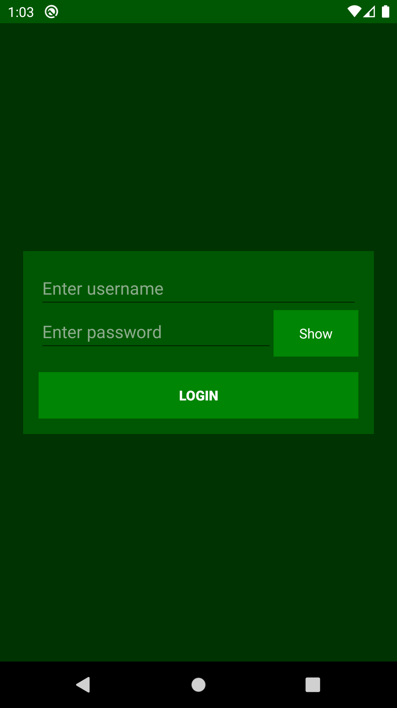
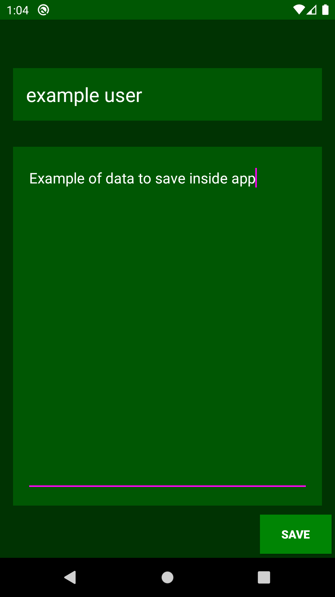

# android-Login-Activity

Basic application that launches a second activity that returns some result  

## Features

- launch second activity to 'login'
- username, password, and data connected in User object
- uses mutableMap to store users <key,value> being <username: String, User>
- create user
- save data to users

## Future

- store users in internal storage with json data
