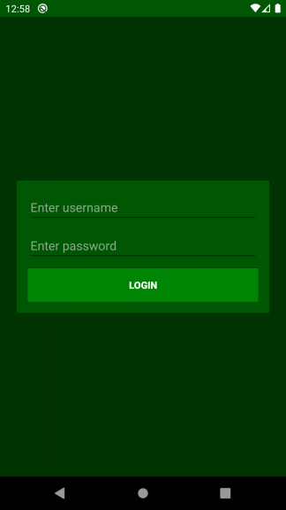

# android-Login-Activity

Basic application that launches a second activity that returns some result  

## Features

- launch second activity to 'login'
- username, password, and data connected in User object

## Future

- store users in internal storage with json data
